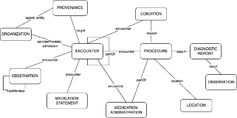

The figure below illustrates graphically the main resource types used to structure RES-Q registry data and how they relate to each other. The core resource selected for representing a clinical case is the **Encounter**. While we considered using Composition, we chose a more semantically-driven model over a document-based approach. In the diagram, we omit the Patient resource for readability purposes.

### List of Profiles

The links and desriptions for the profiles that have been defined for this implementation guide are listed here:

This section lists all **profile narrative pages** included in the guide.

> For the auto-generated summary tables of all artifacts (including StructureDefinitions), see **[Artifacts](artifacts.html)**.


